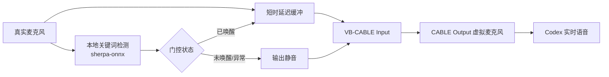

# Codex 实时语音“小欧”唤醒门控

> Windows local wake-word audio gate for Codex realtime voice.

这是一个面向 Windows 的本地隐私小工具：开启 Codex 实时语音聊天后，虚拟麦克风默认只输出静音；说出“小欧”后开始放行语音，说出“结束”后立即恢复静音。

项目不修改 Codex 客户端，不接管 Windows 默认麦克风，也不在运行时调用网络识别服务。关键词检测在本机完成。

> [!IMPORTANT]
> 当前 Codex 客户端把“实时语音聊天”和“听写”共用同一个麦克风设置。本项目通过在实时语音期间临时选择 `CABLE Output`、结束后恢复“系统默认”来限定使用场景；它不能让两种功能同时使用不同麦克风。

## 为什么需要它

实时语音会话打开后，麦克风可能持续处于可用状态。面对办公、家庭或多人环境，用户通常只希望把明确说给 Codex 的内容送入会话，而不希望周围谈话持续进入远端服务。

本项目在真实麦克风和 Codex 之间增加一道本地音频门：

- 默认关闭，虚拟麦克风收到静音。
- 本地识别到“小欧”后持续放行。
- 本地识别到“结束”后恢复静音。
- 唤醒词和结束词本身不进入下游音频。
- 异常、设备错误或缓冲区故障时默认关闭。

## 工作原理



| 你说的话 | 门控状态 | Codex 收到的内容 |
|---|---|---|
| 普通谈话 | 关闭 | 静音 |
| “小欧” | 从关闭变为开启 | 控制词不转发 |
| 后续连续谈话 | 开启 | 放行 |
| “结束” | 从开启变为关闭 | 控制词不转发 |
| 程序异常 | 强制关闭 | 静音 |

## 当前状态

项目目前是 `v0.1.0` 开源准备版本，已在以下环境完成验证：

- Windows 11
- Python 3.11
- Codex Desktop `26.818.5229.0`
- VB-CABLE，虚拟输出原生 `48 kHz`
- `sherpa-onnx 1.13.6`
- 74 项自动化测试
- 真人端到端测试：未唤醒无响应、唤醒后放行、结束后恢复静音

Windows 10、其他 Codex 版本、休眠恢复、设备热插拔和长时间连续运行尚未系统验证。

## 快速开始

完整步骤见 [安装指南](docs/INSTALLATION.md)。核心流程如下：

1. 安装 Python 3.11，并克隆本仓库。
2. 在项目目录创建 `.venv`，安装 `requirements.txt`。
3. 从 sherpa-onnx 官方 Release 下载关键词模型，并解压到 `models/`。
4. 从 VB-Audio 官网安装 VB-CABLE，重启 Windows，并恢复原来的系统默认输入、输出。
5. 运行只读预检：

   ```powershell
   .\.venv\Scripts\python.exe .\preflight_virtual_audio.py
   ```

6. 双击 `启动Codex实时语音小欧门控.cmd`。
7. 在 Codex 设置中临时把麦克风选择为 `CABLE Output (VB-Audio Virtual Cable)`。
8. 进入实时语音，说“小欧”开始，说“结束”停止放行。
9. 退出后停止门控，并把 Codex 麦克风恢复为“系统默认”。

## 隐私边界

- 门控运行期间，真实麦克风音频会在本机内存中交给关键词检测器。
- 关闭状态下，虚拟麦克风只收到静音。
- 开启状态下，允许通过的语音会经 VB-CABLE 进入 Codex；此后的数据处理受 Codex/OpenAI 自身设置和政策约束。
- 本项目不保存录音、不生成全文转写、不上传遥测、不包含网络请求代码。
- Python 依赖、关键词模型和 VB-CABLE 的下载过程会访问各自的外部网站。

详见 [隐私说明](PRIVACY.md) 和 [安全政策](SECURITY.md)。

## 文档

| 文档 | 内容 |
|---|---|
| [安装指南](docs/INSTALLATION.md) | Python、模型、VB-CABLE 和安装后检查 |
| [使用指南](docs/USAGE.md) | 日常启停、Codex 设置和安全退出 |
| [工作原理](docs/ARCHITECTURE.md) | 组件、音频流、状态机和失败保护 |
| [故障排查](docs/TROUBLESHOOTING.md) | 无响应、设备冲突、编码和恢复方法 |
| [隐私说明](PRIVACY.md) | 音频何时本地处理、何时进入 Codex |
| [第三方软件声明](THIRD_PARTY_NOTICES.md) | Python 依赖、模型与 VB-CABLE 许可边界 |
| [贡献指南](CONTRIBUTING.md) | 开发环境、测试和提交规则 |
| [路线图](ROADMAP.md) | 已完成能力和候选改进 |

## 已知限制

- 仅验证 Windows 11；没有 macOS 或 Linux 音频路由实现。
- 依赖外部安装的 VB-CABLE；本仓库不提供、不打包该驱动。
- 当前 KWS 模型权重的再分发许可证尚未得到发布方明确确认，因此模型不会进入仓库或 Release。
- 中文短唤醒词存在误识别和漏识别可能，不能承诺零误唤醒。
- Codex 客户端升级后，设备名称、设置入口或音频行为可能变化。
- 本项目不能控制 Codex 在门控程序之外如何使用已选麦克风，也不能替代操作系统麦克风权限管理。

## 开发与验证

```powershell
$env:PYTHONPATH=(Resolve-Path '.').Path
.\.venv\Scripts\python.exe -m unittest discover -s tests -v
.\.venv\Scripts\python.exe .\preflight_virtual_audio.py
```

真人麦克风验收必须由操作者主动运行：

```powershell
.\.venv\Scripts\python.exe .\run_stage_a_acceptance.py
```

测试不会证明所有麦克风、驱动或 Codex 版本都兼容。请在真实环境完成 [公开发布检查清单](docs/OPEN_SOURCE_RELEASE_CHECKLIST.md)。

## 参与贡献

欢迎提交问题、改进文档或提供兼容性测试结果。请先阅读 [贡献指南](CONTRIBUTING.md) 和 [行为准则](CODE_OF_CONDUCT.md)。安全或隐私问题不要公开提交，请按 [安全政策](SECURITY.md) 使用私密报告渠道。

## 许可证与声明

本项目代码和项目文档采用 [Apache License 2.0](LICENSE)。第三方软件、模型和驱动保持各自许可证，不因本项目许可证而改变。

本项目是独立社区工具，与 OpenAI、Microsoft、VB-Audio 或 k2-fsa 没有隶属、授权或背书关系。“Codex”“VB-CABLE”和其他名称归各自权利人所有。
